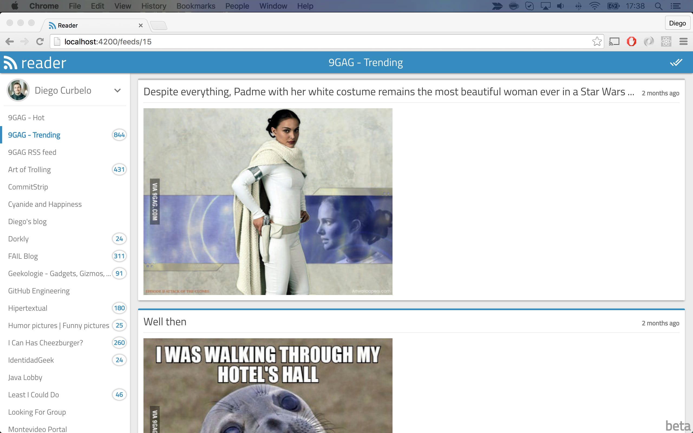

# Reader 

A simple, free and open source web-based RSS feed reader which can be self hosted or used through [reader.uy](https://reader.uy?ref=github).

It has responsive design with support for desktop and mobile browsers. Elixir/Phoenix is used for the backend and Javascript/React for the frontend.

>The previus version based on PHP and Ember can be found [here](https://github.com/diegocurbelo/reader-backend-php) and [here](https://github.com/diegocurbelo/reader-web-ember).

---

